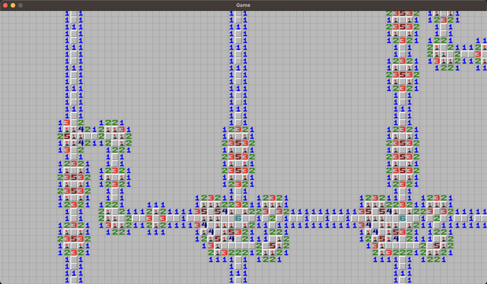

---
tags:
  - misc
  - game
  - z3
---

# Mine the gap

You are given a script `minesweeper.py`, and a text file, `gameboard.txt`. Invoking the python script requires `pygame` to be installed.

    pip install pygame

It takes several seconds to load. After loading, we get a minesweeper game



Inspect the script and search for CTF / FLAG etc.

We see this part of the code:

```python
    if len(violations) == 0:
        bits = []
        for x in range(GRID_WIDTH):
            bit = 1 if validate_grid[23][x].state in [10, 11] else 0
            bits.append(bit)
        flag = hashlib.sha256(bytes(bits)).hexdigest()
        print(f'Flag: CTF{{{flag}}}')

    else:
        print(violations)
```

We need to solve it, and then we can reconstruct the flag from the solution.

Inspect `gameboard.txt` -- it looks like the board is in a simple text format.

The board looks pretty structured. Putting one mine will collapse many other cells, but not all.

```bash
❯ wc gameboard.txt
    1631  198991 5876831 gameboard.txt
```

The board is 1600 x 3600 cells. It is huge. It is not possible to solve it by hand.

We need to solve the board with code.

Idea 1 use backtracking and pray to be fast enough.

Idea 2 skip backtracking and use SAT solver (Z3). This is what we did.

With Z3, we can create variables and constraints on the values they can get, then ask for a solution. If there is a solution, Z3 will give us the values for the variables. Z3 will find an answer in a reasonable™️ time.

Check the code to generate the solution. With the answer, we can easily recover the flag using the game's code.

```python
import z3

with open('gameboard.txt') as f:
    data = f.read().split('\n')


rows = len(data)
cols = len(data[0])
print(rows, cols, flush=True)

solver = z3.Solver()

vars = {}

def get_var(i, j):
    assert data[i][j] == '9'
    if (i, j) not in vars:
        vars[i, j] = z3.Int(f'var_{i}_{j}')
        solver.add(0 <= vars[i, j])
        solver.add(vars[i, j] <= 1)
    return vars[i, j]


for i in range(rows):
    for j in range(cols):
        if data[i][j] in '12345678':
            flags_on = 0
            pending = []

            for dx in [-1, 0, 1]:
                for dy in [-1, 0, 1]:
                    if dx == 0 and dy == 0:
                        continue

                    nx = i + dx
                    ny = j + dy

                    if 0 <= nx < rows and 0 <= ny < cols:
                        if data[nx][ny] == 'B':
                            flags_on += 1
                        elif data[nx][ny] == '9':
                            pending.append(get_var(nx, ny))

            if not pending:
                continue

            solver.add(z3.Sum(pending) + flags_on == int(data[i][j]))

print(len(vars))

for i in range(rows):
    for j in range(cols):
        if data[i][j] == '9':
            assert (i, j) in vars

print("Solving...")
print(solver.check())

for (i, j), v in vars.items():
    if solver.model()[v] == 1:
        print(i, j)
```
